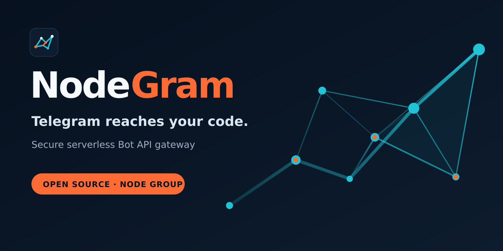
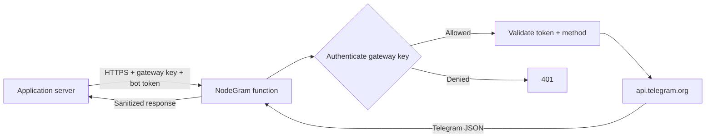

# NodeGram



**A secure, serverless Telegram Bot API gateway for networks that cannot reach Telegram directly.**

[](https://www.typescriptlang.org/)
[](https://www.digitalocean.com/products/functions)
[](LICENSE)

NodeGram lets an application call a small authenticated gateway hosted on DigitalOcean Functions. The gateway validates the caller, accepts that caller's Telegram bot token on each request, forwards the call to the official Telegram Bot API, and returns Telegram's response. It is designed for teams whose application servers cannot connect to `api.telegram.org` directly.

NodeGram is an open-source project by [NODE Group](https://www.nodegroup.ir/).

> [!IMPORTANT]
> NodeGram is an application-layer gateway for the **official Telegram Bot API**. It is not an MTProto proxy, VPN, user-account client, censorship-circumvention service for Telegram apps, or general-purpose HTTP proxy. It must never accept arbitrary upstream URLs.

## Why NodeGram?

- One small HTTPS endpoint reachable by your application servers
- Each caller sends their own Telegram bot token per request
- Multi-project access with separate revocable gateway client keys
- Fixed upstream origin prevents SSRF and open-proxy abuse
- Compatible with any language that can send an HTTPS POST
- Stateless and inexpensive at low or irregular traffic volumes
- Deployable with `doctl` to DigitalOcean Functions

## How it works



The client sends a request envelope to one Function URL:

```json
{
  "token": "123456789:AA...your_bot_token...",
  "method": "sendMessage",
  "params": {
    "chat_id": "123456789",
    "text": "Hello from NodeGram"
  }
}
```

The request includes `Authorization: Bearer ng_live_...` (gateway access key). Each call also includes that caller's Telegram bot `token`, so every app can use its own bot. The gateway validates the access key, validates the token shape, then sends:

```text
POST https://api.telegram.org/bot<token>/<method>
```

Bot tokens must not appear in the URL path or query string of the NodeGram request, and are never written to logs.

## Scope of v1.1

### Supported

- Official Telegram Bot API methods with valid method names
- Per-request Telegram bot tokens (each caller uses their own bot)
- JSON parameters
- Existing Telegram `file_id` values
- Public HTTPS media URLs accepted by Telegram
- Short polling with `getUpdates` (`timeout` should remain at or below the configured gateway timeout)
- Multiple gateway client keys (revocable access to the Function)
- `POST` requests to one gateway endpoint

### Deliberately unsupported

- MTProto, Telegram user accounts, SOCKS/HTTP proxying, or arbitrary upstream URLs
- Multipart binary uploads
- Proxying file downloads from Telegram
- Webhook receiving/forwarding
- Guaranteed distributed per-client rate limiting without an external shared store

DigitalOcean Functions currently limits input parameters and result responses to **1 MB**. Base64/raw-body handling can further reduce usable binary capacity. Use a Telegram `file_id` or a public HTTPS URL for media. If large binary transfer or webhook fan-out becomes a requirement, deploy a separate streaming service on DigitalOcean App Platform rather than weakening this Function design. See [DigitalOcean Functions limits](https://docs.digitalocean.com/products/functions/details/limits/).

## API contract

### `POST /` — relay a Bot API method

Headers:

```http
Authorization: Bearer ng_live_REPLACE_ME
Content-Type: application/json
```

Body:

| Field    | Type   | Required | Rules                                                               |
| -------- | ------ | -------- | ------------------------------------------------------------------- |
| `token`  | string | Yes      | Telegram bot token; shape `digits:secret` (validated, never logged) |
| `method` | string | Yes      | Telegram method; `^[A-Za-z][A-Za-z0-9]{0,63}$`                      |
| `params` | object | No       | JSON object, default `{}`                                           |

Success returns Telegram's JSON body and HTTP status. NodeGram-generated errors use this shape:

```json
{
  "ok": false,
  "error": {
    "code": "UNAUTHORIZED",
    "message": "Invalid or missing client credentials",
    "request_id": "..."
  }
}
```

Required status behavior:

| Status | Meaning                                                      |
| ------ | ------------------------------------------------------------ |
| `200`  | Telegram accepted the request; inspect Telegram's `ok` field |
| `400`  | Invalid NodeGram request envelope                            |
| `401`  | Missing or invalid client key                                |
| `403`  | Authenticated client is not allowed to perform this action   |
| `405`  | Method other than `POST`                                     |
| `413`  | Request exceeds NodeGram's conservative payload limit        |
| `429`  | Local best-effort throttle or Telegram rate limit            |
| `502`  | Invalid/unavailable Telegram upstream response               |
| `504`  | Telegram request timed out                                   |

### `GET /?health=1` — health check

Returns build/version information without checking Telegram or revealing configuration. Do not expose client IDs, token fragments, or secret fingerprints.

## Client examples

Set these values on the application server:

```bash
export NODEGRAM_URL="https://example.doserverless.co/api/v1/web/.../nodegram/gateway"
export NODEGRAM_API_KEY="ng_live_replace_me"
export TELEGRAM_BOT_TOKEN="123456789:AA...your_bot_token..."
```

### cURL

```bash
curl --request POST "$NODEGRAM_URL" \
  --header "Authorization: Bearer $NODEGRAM_API_KEY" \
  --header "Content-Type: application/json" \
  --data "{
    \"token\": \"$TELEGRAM_BOT_TOKEN\",
    \"method\": \"sendMessage\",
    \"params\": {\"chat_id\": \"123456789\", \"text\": \"Hello from NodeGram\"}
  }"
```

### Node.js / TypeScript

```ts
const response = await fetch(process.env.NODEGRAM_URL!, {
  method: "POST",
  headers: {
    authorization: `Bearer ${process.env.NODEGRAM_API_KEY}`,
    "content-type": "application/json",
  },
  body: JSON.stringify({
    token: process.env.TELEGRAM_BOT_TOKEN,
    method: "sendMessage",
    params: { chat_id: "123456789", text: "Hello from NodeGram" },
  }),
});

const result = await response.json();
if (!response.ok || !result.ok) throw new Error(JSON.stringify(result));
```

### PHP

```php
<?php
$payload = json_encode([
    'token' => getenv('TELEGRAM_BOT_TOKEN'),
    'method' => 'sendMessage',
    'params' => ['chat_id' => '123456789', 'text' => 'Hello from NodeGram'],
]);

$ch = curl_init(getenv('NODEGRAM_URL'));
curl_setopt_array($ch, [
    CURLOPT_POST => true,
    CURLOPT_RETURNTRANSFER => true,
    CURLOPT_HTTPHEADER => [
        'Authorization: Bearer ' . getenv('NODEGRAM_API_KEY'),
        'Content-Type: application/json',
    ],
    CURLOPT_POSTFIELDS => $payload,
]);
$body = curl_exec($ch);
$status = curl_getinfo($ch, CURLINFO_HTTP_CODE);
curl_close($ch);
```

### Python

```python
import os
import requests

response = requests.post(
    os.environ["NODEGRAM_URL"],
    headers={"Authorization": f"Bearer {os.environ['NODEGRAM_API_KEY']}"},
    json={
        "token": os.environ["TELEGRAM_BOT_TOKEN"],
        "method": "sendMessage",
        "params": {"chat_id": "123456789", "text": "Hello from NodeGram"},
    },
    timeout=20,
)
response.raise_for_status()
print(response.json())
```

## Secret configuration

NodeGram reads a base64-encoded JSON document from `NODEGRAM_CLIENTS_B64`. Base64 prevents quoting mistakes; **it is not encryption**. Store the variable as an encrypted secret in the deployment environment and never commit the real value.

Decoded structure (gateway access keys only — Telegram bot tokens are sent per request by callers):

```json
{
  "schemaVersion": 1,
  "clients": [
    {
      "id": "website-production",
      "keySha256": "64-lowercase-hex-characters",
      "enabled": true
    }
  ]
}
```

Generate a gateway client key and hash:

```bash
npm run keygen
# prints the client key once and its SHA-256 hash
```

Generate the secret value:

```bash
node scripts/encode-config.mjs config/clients.local.json
```

Operational rules:

- Give each environment/project its own gateway client key.
- Store only SHA-256 client-key hashes in gateway configuration.
- Each application keeps its own Telegram bot token and sends it in the JSON body as `token`.
- Rotate a compromised gateway key immediately; accept two hashes temporarily during planned rotation if needed.
- Never log authorization headers, config, bot tokens, bodies, chat IDs, messages, or upstream URLs containing tokens.
- Keep `.env`, `clients.local.json`, and all generated secrets out of Git.

## Deploy to DigitalOcean Functions

The implementation target is Node.js 22 and TypeScript compiled into one small CommonJS bundle. DigitalOcean currently supports `nodejs:22`; the handler receives `(event, context)` and returns a response object. See the official [Node.js runtime documentation](https://docs.digitalocean.com/products/functions/reference/runtimes/node-js/) and [`project.yml` reference](https://docs.digitalocean.com/products/functions/reference/project-configuration/).

### 1. Install and authenticate `doctl`

Follow DigitalOcean's installation guide, authenticate with a scoped API token, then install serverless support:

```bash
doctl auth init
doctl serverless install
```

### 2. Create and connect a namespace

Create a Functions namespace in a region that can reach both Telegram and your application hosts, then:

```bash
doctl serverless namespaces list
doctl serverless connect <namespace-label-or-uuid>
```

Use a current namespace access key. DigitalOcean deprecated the legacy shared namespace token and scheduled its removal for June 2026.

### 3. Configure local deployment secrets

```bash
cp .env.example .env
```

Populate `NODEGRAM_CLIENTS_B64`, `NODEGRAM_REQUEST_TIMEOUT_MS`, `NODEGRAM_MAX_BODY_BYTES`, and optional CORS settings. `.env` must stay untracked.

### 4. Test and build

```bash
npm ci
npm run lint
npm run typecheck
npm test
npm run build
```

### 5. Deploy

```bash
doctl serverless deploy . --remote-build
doctl serverless functions get nodegram/gateway --url
```

The `project.yml` must configure `web: raw`, `runtime: nodejs:22`, a conservative timeout, 256 MB memory, and environment substitutions. The build must output a CommonJS `bundle.js` exporting `main`; `.include` must include only the production bundle/package metadata required by DigitalOcean.

### 6. Smoke test

Call the health endpoint first, then `getMe` with your bot token in the body, and finally `sendMessage` to a private test chat. Do not test using production chat IDs before verifying configuration.

## Recommended repository structure

```text
.
├── brand/
├── config/
│   └── clients.example.json
├── packages/nodegram/gateway/
│   ├── src/
│   ├── test/
│   ├── .include
│   ├── build.js
│   └── package.json
├── scripts/
│   ├── encode-config.mjs
│   └── keygen.mjs
├── .env.example
├── .gitignore
├── CONTRIBUTING.md
├── LICENSE
├── SECURITY.md
├── package.json
└── project.yml
```

## Security model

| Threat                | Required mitigation                                                                                        |
| --------------------- | ---------------------------------------------------------------------------------------------------------- |
| Open proxy / SSRF     | Hard-code `https://api.telegram.org`; never accept a host, URL, protocol, redirect target, or port         |
| Stolen client key     | Store only key hashes; constant-time compare; separate keys; easy rotation                                 |
| Bot-token exposure    | Tokens transit only over HTTPS; never log tokens or put them in NodeGram URLs/query strings                |
| Open anonymous relay  | Require a revocable gateway Bearer key; reject missing/invalid keys with 401                               |
| Oversized payload     | Reject using both declared length and decoded byte length before upstream fetch                            |
| Hanging upstream      | AbortController timeout capped below Function deadline                                                     |
| Redirect attack       | `redirect: "error"` on upstream fetch                                                                      |
| Secret-bearing errors | Map upstream/network errors to sanitized stable codes                                                      |
| Replay                | Telegram methods are not generally idempotent; document client retries and never auto-retry mutation calls |
| Timing leak           | Compare fixed-length binary hashes with `crypto.timingSafeEqual`                                           |

Best-effort in-memory throttling may reduce accidental bursts inside a warm instance, but it is not a distributed quota. Strict quotas require a shared low-latency store or an API gateway outside the Function.

## Observability

Emit one structured JSON log per request containing only:

- timestamp
- request ID
- anonymized client ID or stable non-secret hash
- numeric bot id only when `NODEGRAM_LOG_BOT_ALIAS=true` (never the token secret)
- Telegram method
- NodeGram outcome code
- upstream status
- duration in milliseconds
- cold-start flag

Never log request bodies, response bodies, chat IDs, message text, authorization values, bot tokens, resolved Telegram URLs, or the secret configuration.

## Development principles

- Use the built-in Node.js `fetch`, `crypto`, and `AbortController` APIs where possible.
- Keep runtime dependencies minimal to reduce cold starts and supply-chain risk.
- Separate pure request validation/authentication from the DigitalOcean adapter for easy unit testing.
- Preserve Telegram's JSON response rather than inventing a competing Bot API schema.
- Do not retry Telegram mutation methods automatically.
- Pin toolchain versions and commit the lockfile.

## Roadmap

- v1: authenticated JSON gateway, tests, deployment workflow
- v1.1: per-request Telegram bot tokens so each caller uses their own bot
- v1.2 candidate: small official client package and usage metrics without sensitive content
- v2 candidate: optional shared rate-limit store and admin configuration service
- Separate service candidate: webhook forwarding and streamed media, hosted on App Platform—not Functions

## Responsible use

Operators are responsible for complying with Telegram's terms, DigitalOcean's acceptable-use policy, applicable law, and organizational security requirements. Do not deploy NodeGram as an anonymous public relay. NodeGram is independent software and is not affiliated with or endorsed by Telegram or DigitalOcean.

## Documentation

- [Architecture](docs/architecture.md)
- [API contract](docs/api.md)
- [Security](docs/security.md)
- [DigitalOcean deployment](docs/deployment-digitalocean.md)
- [Operations](docs/operations.md)
- Client guides: [Node.js](docs/using-from-node.md), [PHP](docs/using-from-php.md), [Python](docs/using-from-python.md), [cURL](docs/using-with-curl.md)
- ADRs: [envelope API](docs/adr/0001-function-envelope-api.md), [no binary proxy](docs/adr/0002-no-binary-proxy.md), [static config](docs/adr/0003-static-secret-config.md)

## Contributing and security

Contributions are welcome. Use `CONTRIBUTING.md` for development workflow and `SECURITY.md` for private vulnerability reporting. Never open a public issue containing a bot token, client key, chat ID, or message payload.

## License

MIT © NODE Group. See `LICENSE`.

---

Built by [NODE Group](https://www.nodegroup.ir/) — building practical software for real constraints.
