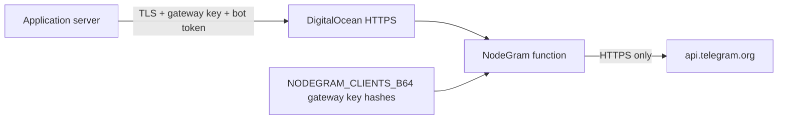

# Architecture

NodeGram is a DigitalOcean Functions application that relays authenticated JSON envelopes to the official Telegram Bot API.

## Trust boundaries

1. **Client → NodeGram**: TLS terminates at DigitalOcean. Callers present a Bearer gateway key **and** their Telegram bot token in the JSON body.
2. **NodeGram process**: Validates the gateway key, validates token/method/params shapes, builds a fixed-origin upstream URL.
3. **NodeGram → Telegram**: HTTPS POST to `https://api.telegram.org` with `redirect: "error"`. Gateway Authorization is never forwarded upstream.

## Why per-request tokens

Each application (or tenant) can use its own Telegram bot without storing bot tokens in the Function configuration. The gateway key only controls who may invoke the Function.

## Request sequence

1. DigitalOcean invokes `main(event, context)` with a `web: raw` event.
2. Route health (`GET ?health=1`) or CORS preflight when enabled.
3. Load and cache frozen gateway-client configuration from `NODEGRAM_CLIENTS_B64`.
4. Authenticate Bearer key with SHA-256 + `timingSafeEqual`.
5. Validate JSON envelope (`token`, `method`, `params`).
6. Optional best-effort in-memory token bucket.
7. Call Telegram with timeout capped below `context.getRemainingTimeInMillis()`.
8. Return Telegram JSON or a NodeGram error envelope; emit exactly one completion log.

## Platform constraints

DigitalOcean Functions limits input parameters and result responses to **1 MB**. NodeGram does not proxy multipart uploads or file downloads. Use Telegram `file_id` values or public HTTPS media URLs.

## Future shared quotas

v1 has no database. Strict global quotas would require an external low-latency store. See the isolated `limits.ts` module.
