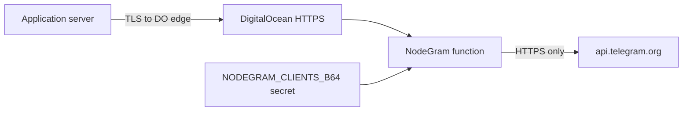

# Architecture

NodeGram is a DigitalOcean Functions application that relays authenticated JSON envelopes to the official Telegram Bot API.

## Trust boundaries

1. **Client → NodeGram**: TLS terminates at DigitalOcean. Callers present a Bearer client key. Bot tokens are never sent by clients.
2. **NodeGram process**: Validates the envelope, authenticates the key hash, resolves a client-owned bot alias to a token from secret configuration, and builds a fixed-origin upstream URL.
3. **NodeGram → Telegram**: HTTPS POST to `https://api.telegram.org` with `redirect: "error"`. Client authorization headers are never forwarded.

## Request sequence

1. DigitalOcean invokes `main(event, context)` with a `web: raw` event (base64 body + HTTP metadata).
2. Route health (`GET ?health=1`) or CORS preflight when enabled.
3. Load and cache frozen client configuration from `NODEGRAM_CLIENTS_B64`.
4. Authenticate Bearer key with SHA-256 + `timingSafeEqual` (dummy digest always compared).
5. Validate JSON envelope (`bot`, `method`, `params`).
6. Authorize bot alias within the authenticated client's map only.
7. Optional best-effort in-memory token bucket (warm instance only).
8. Call Telegram with timeout capped below `context.getRemainingTimeInMillis()`.
9. Return Telegram JSON or a NodeGram error envelope; emit exactly one completion log.

## Modules

| Module        | Responsibility                            |
| ------------- | ----------------------------------------- |
| `index.ts`    | DigitalOcean adapter                      |
| `domain.ts`   | Types, limits, error codes                |
| `config.ts`   | Decode / validate / cache secrets         |
| `auth.ts`     | Bearer parsing and constant-time auth     |
| `request.ts`  | Raw event parsing and envelope validation |
| `telegram.ts` | Fixed-origin upstream adapter             |
| `response.ts` | Safe DO responses and headers             |
| `cors.ts`     | Exact-origin allowlisting                 |
| `logger.ts`   | Redacted structured logs                  |
| `limits.ts`   | Best-effort warm-instance rate limit      |

## Future shared quotas

v1 has no database. Strict global per-client quotas would require an external low-latency store (for example Redis) or an API gateway in front of the Function. The limiter module is intentionally isolated so a shared store can replace the in-memory bucket without changing the public API.

## Platform constraints

DigitalOcean Functions limits input parameters and result responses to **1 MB**. NodeGram therefore does not proxy multipart uploads or file downloads. Use Telegram `file_id` values or public HTTPS media URLs.
